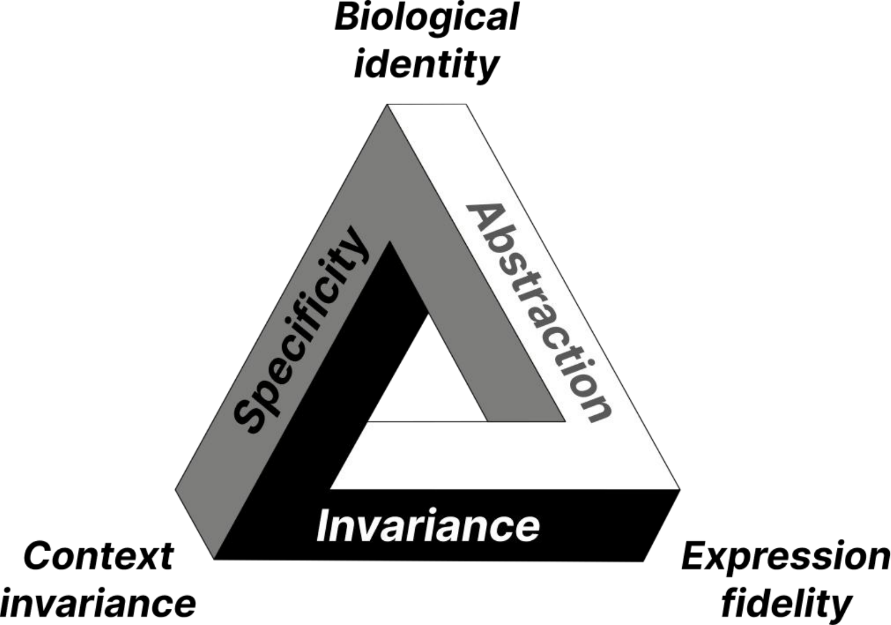
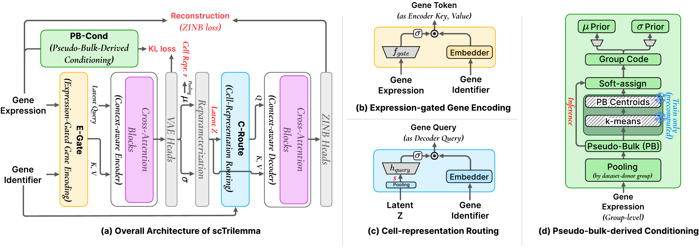

# scTrilemma

Official implementation of **scTrilemma: Balancing Identity, Invariance, and Fidelity in
Single-Cell Representation Learning** (NeurIPS 2026).

<p align="center"></p>

> <small>**Figure 1 — the representation trilemma.** Biological identity preserves cell-type and state structure, context invariance prevents nuisance context from defining cellular similarity, and expression fidelity retains the gene-level variation needed for biological analysis.</small>

scTrilemma is a latent-bottleneck VAE for label-free single-cell representation learning.
It treats the competing demands of biological identity, context invariance and expression
fidelity as an information-routing problem: expression-gated gene encoding (E-Gate) controls
what reaches the cell embedding, the cell representation is routed through the decoder
(C-Route), and unlabeled pseudo-bulk context conditions the prior (PB-Cond), all under a
single reconstruction objective.

This repository contains the model, the training recipe used for the released checkpoint,
the data-preparation pipeline, the zero-shot benchmark, and the analyses behind every table
and figure of the paper together with their result files.

<p align="center"></p>

> <small>**Figure 2 — scTrilemma architecture.** (a) Overall routing architecture trained with ZINB reconstruction and KL regularization. (b) E-Gate applies an expression-derived feature-wise gate before latent compression. (c) C-Route mean-pools posterior means for the evaluated cell representation and uses the pooled latent sample to modulate decoder queries, while the full sampled latent tokens remain reconstruction memory. (d) PB-Cond softly assigns dataset–donor pseudo-bulks to fixed pretraining centroids to parameterize the conditional prior.</small>

## Repository layout

```
src/sctrilemma/           model, data pipeline, training entry point, inference helpers, benchmark
configs/                  training recipe (sctrilemma.yaml), ablation arms (experiment/), dataset manifests (zsb/)
scripts/preprocessing/    Census download -> pseudo-bulk -> cache -> tissue codes (steps 0-6)
scripts/training/         train.sh
scripts/evaluation/       benchmark and embedding-export wrappers
experiments/              paper analyses: one folder per table/figure, each with scripts + results/ + README
docs/                     figures used in this README
checkpoints/              put the released checkpoint here (not tracked)
```

## Environment

Dependencies are pinned in `pyproject.toml` / `pixi.lock` (Python 3.11, PyTorch 2.8 with CUDA 12.8,
Lightning 2.6, scib-metrics, FAISS).

```bash
pixi install --locked
pixi run torch-cuda-check
pixi run python -m sctrilemma.benchmark.run --help
```

Run everything from the repository root through `pixi run python ...` (or `pixi shell`).

## Released checkpoint

| File | Size | SHA-256 |
|---|---|---|
| `final.ckpt` | 223 MB | `58981767d498c5d9c4087276bc2853cb6d5c338fc5048d84b3d8f8c9cacf5f76` |

The checkpoint is hosted on the Hugging Face Hub at <https://huggingface.co/yunhak0/scTrilemma>.
Either command places it at `checkpoints/sctrilemma/final.ckpt` (the default path of every
script) and verifies the checksum:

```bash
pixi run download-checkpoint                             # curl
pixi run bash scripts/download_checkpoint.sh --python    # huggingface_hub (part of the environment)
```

It is the model reported in the paper: trained for 25,000 steps on the 2025-01-30 CELLxGENE
Census release (62.6 M cells, 478 datasets) with the recipe in `configs/sctrilemma.yaml`; the
file contains the weights and the model/data configuration only.

## Quick start: embed and reconstruct an AnnData

```python
import anndata as ad
import torch

from sctrilemma.inference import embed_adata, reconstruct_adata
from sctrilemma.model.vae_module import ScTrilemmaModule

module = ScTrilemmaModule.load_from_checkpoint(
    "checkpoints/sctrilemma/final.ckpt",
    map_location="cuda" if torch.cuda.is_available() else "cpu",
    weights_only=False,
)
module.eval()

adata = ad.read_h5ad("/path/to/dataset.h5ad")            # raw counts, var_names = Ensembl gene IDs
vocab = "/path/to/20250130/gene_vocab_homo_sapiens_20250130.json"
embeddings = embed_adata(module, adata, gene_vocab_path=vocab)                  # (n_cells, 512)
reconstruction, gene_names = reconstruct_adata(module, adata, gene_vocab_path=vocab)
```

Inference needs only the checkpoint and the gene vocabulary of the training release
(`scripts/preprocessing/0_download_metadata.sh`); the pseudo-bulk and tissue-code files are
training-time inputs of the prior and do not affect embeddings or reconstructions.

## Data

All scripts read the CELLxGENE Census exports from `SCTRILEMMA_DATA_ROOT`
(default `/scratch/$USER/datasets/cellxgene`):

```
$SCTRILEMMA_DATA_ROOT/
├── 20250130/                                  # training release
│   ├── by_dataset/<dataset_id>/part_XXX.h5ad  # raw counts, <= 100k cells per shard
│   ├── by_dataset_cache/                      # .npz caches used by the training loader
│   ├── gene_vocab_homo_sapiens_20250130.json
│   ├── cell_type_vocab_homo_sapiens_20250130.json
│   ├── pseudo_bulk_dict_with_20251108.pt      # dataset-donor pseudo-bulk profiles
│   └── tissue_codes_k32_with_20251108.pt      # their k-means soft assignments (PB-Cond input)
└── 20251108/                                  # held-out release (evaluation)
    └── by_dataset/<dataset_id>/part_XXX.h5ad
```

`scripts/preprocessing/` rebuilds this layout (run each step for `CENSUS_TAG=20250130` and,
for the held-out release, steps 0-2 with `CENSUS_TAG=20251108`):

| Step | Script | Output |
|---|---|---|
| 0 | `0_download_metadata.sh` | cell/gene metadata, gene and cell-type vocabularies |
| 1 | `1_download_census.sh` | `by_dataset/` h5ad shards |
| 2 | `2_calculate_pseudobulk.sh` | `pseudo_bulk_dict.pt` (log1p mean CP10K per dataset-donor group) |
| 3 | `3_preprocess_cache.sh` | `by_dataset_cache/` (training release only) |
| 4 | `4_build_tissue_codes.sh` | k-means (K = 32) tissue codes and centroids |
| 5 | `5_extend_to_release.sh` | pseudo-bulk profiles and codes extended to the held-out release |
| 6 | `6_build_control_codes.sh` | shuffled / constant control codes (ablation arms only) |

The training release occupies about 1.1 TB (`by_dataset`) plus 1.4 TB (`by_dataset_cache`).

## Training

```bash
bash scripts/training/train.sh                          # released recipe: 4 GPUs, DDP, 25k steps
bash scripts/training/train.sh experiment=ablation_no_egate
bash scripts/training/train.sh auto_resume=true         # resume the latest checkpoint
```

`configs/sctrilemma.yaml` holds the complete recipe (architecture, optimizer, KL schedule,
data loading); `configs/experiment/` holds the six ablation arms of Figure 3 as overlays.
Validation during training uses the ten held-out datasets in `configs/zsb/val_subset_10_ids.txt`;
checkpoints are written to `checkpoints/<experiment_name>/`.

## Evaluation

```bash
bash scripts/evaluation/run_single_dataset_example.sh     # one held-out dataset, one GPU (setup check)
bash scripts/evaluation/run_benchmark_4gpu.sh             # all 89 held-out datasets on four GPUs
bash scripts/evaluation/export_embeddings.sh              # embedding caches for the Table 1 scorers
```

`python -m sctrilemma.benchmark.run` scores a checkpoint on held-out datasets (embedding metrics,
reconstruction metrics, profiling); `configs/zsb/full_89_ids.txt` lists the 89 datasets of the
paper (datasets first appearing in the 2025-11-08 release).

## Reproducing the paper

`experiments/` contains one folder per table or figure with the scripts that produced it and
the result files the paper was built from (`results/`); see `experiments/README.md` for the
index and the shared pieces (sampling, gene lists, embedding and reconstruction scorers).
Numbers of the baseline methods are provided as result files; their code is not part of this
repository (versions and checkpoints are listed in the paper's appendix).

## Citation

The paper reference will be added once the proceedings version is available.
